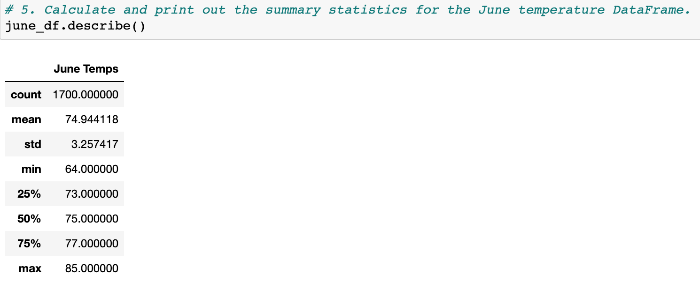
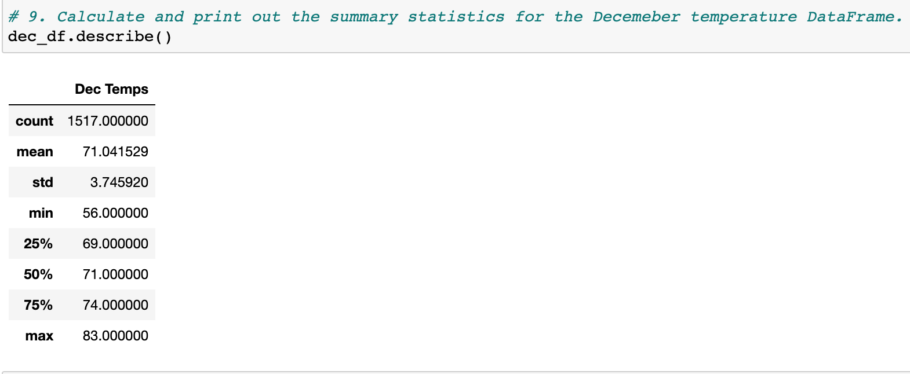

# Surfs-Up Analysis | New Business

## Overview of Oahu Weather
Climate Analysis of Oahu for the month of June & December 

### Purpose
Help W. Avy with analysis, get more information about temperature trends before opening the surf shop. Specifically, the purpose of the analysis is:
-  temperature data for the months of June and December in Oahu.
-  Based on analysis results, determine if the surf and ice cream shop business is sustainable year-round.

## June Results

### Analysis of June temperature

As per the analysis the summer weather for the month of June is: 
- Maximum: 85 F
- Minimum: 64 F
- Average: 74.94 F
    

### December Results

As per the analysis the summer weather for the month of December is: 
- Maximum: 83 F
- Minimum: 56 F
- Average: 71.04 F

## Surfs Up Summary

This explains the summary of the weather analysis. In this particular analysis, it shows that the weather is very similar in Ohau for the month of Jume & December. For the average temperature, there is only the difference of 3 Degrees Farenhit. It comes to an conclusion, that the surf and ice cream shop business is sustainable year-round.
To be more precise, we can also add two more queries to get data for the month of August and October to verify that weather is similar through out:
- Month of August: session.query(Measurement.tobs).filter(extract('month', Measurement.date) == 8).all()
- Month of October: session.query(Measurement.tobs).filter(extract('month', Measurement.date) == 10).all()

